Bellabeat analysis
================
Goik Dominika
2023-10-31

# Bellabeat Analysis of the usage data

**Bellabeat** is a health and wellness technology company that creates
smart jewelry and accessories designed to track and improve women’s
overall well-being. Their products, such as activity trackers and smart
jewelry, combine fashion with functionality, allowing users to monitor
their activity, sleep, stress levels, and menstrual cycles. Bellabeat’s
devices are tailored to the unique health needs of women, providing
insights and guidance to support a balanced lifestyle. In this analysis
I have focused the most on Bellabeat membership implementation and
advertisement, which is a subscription-based membership program that
grants users round-the-clock access to personalized advice on nutrition,
physical activity, sleep, health and beauty, and mindfulness, tailored
to their individual lifestyles and objectives.

- **Stakeholders:**

  - Urška Sršen: Bellabeat’s cofounder and Chief Creative Officer  
  - Sando Mur: Mathematician and Bellabeat’s cofounder; key member of
    the Bellabeat executive team  
  - Bellabeat marketing analytics team

**Main analysis objective:**

**1. User-oriented approach** Identifying weekly and hourly trends in
user data which will be used to improve Bellabeat health and wellness
guidance, and encourage data record entry by users.  
**2. Marketing-oriented approach** Identifying weekly and hourly trends
in user data which will be used to improve the advertising strategy of
the company towards new users.

## Quality of the datasets

Data sets are sourced from the [Kaggle “FitBit Fitness Tracker Data”
collection](https://www.kaggle.com/datasets/arashnic/fitbit) containing
the records of sleep, heart rate and activity levels of 33 users between
March 12th 2016 and May 12th 2016. It contains a disclaimer that the
variables in output arrive due to the usage of different types of Fitbit
trackers, which can be seen in the dataset (for example Sedentary
Distance which is more than 0 in the case of 82 records coming from 10
users).  
Data sets are updated annually and are under the CC0:Public Domain
License.  
Data sets have a small sample of users with 33 max number for some data
sets, while others have only 14 or only 8 users. This poses a big
problem since a minimal significant sample should contain at least 100
users. That is why it should be advised to gather data from more users
to create a significant analysis that will produce more confident
results. (However, I do not have that possibility in that project thus
we will treat that 33-user sample as a “bearable” size.) If we would
like to have the best sample size in the case of Fitbit users population
it should count around 385 users minimum.  
The data come from the
[source](https://zenodo.org/records/53894#.YMoUpnVKiP9) but were just
reposed to Kaggle, where acknowledgment is given to the original direct
source.  
Regarding comprehensiveness, we do not know what units are being used to
measure intensity, distance, or at what time the person went to sleep,
or when did they wake up. Furthermore, data is missing millisecond
measurement in heart rate which makes calculation of stress through the
day impossible. There is a different number of users for different data
sets for example we observe 33 users in the “daily Activity” table while
in the “weight” table there are only 8 users. Additionally, in the
weight table, there are many NA values in the “Fat” column. Besides that
we do not know what job our users perform, and most importantly what
gender are they. Next, there are no data such as water intake or
menstrual cycle entries. This leads to decreasing our analysis to assess
the: activity and sleep variables. Since we do not possess the data for
the rest.  
Data are pretty well cited since they are being sued in the capstone
project of a very popular Data Analyst Course. Regarding the date of
collection of the data was 2016 the data sets are not current.  
Data sets are divided into three main categories by time:

- daily data: steps, calories, activity, intensity  
- hour data: steps, calories, intensity  
- minute: calories, steps, METs, sleep, intensity  
- second: heart rate  
- weight which has different hours, minutes, and seconds.  
  Minute data sets are provided in the narrow and wide tables.

# Data sets used

Daily data sets regarding activity, calories, and steps will be used to
assess the number of entries during the week and try to identify the
weekly trends in activity patterns, caloric intake as well and steps
taken. Additionally number of days logging will be measured against the
mentioned variables to see whether the number of log entries does impact
them.  
Hourly steps, caloric and intensity data will be used to assess the
hourly pattern of mentioned variables for each weekday to asses the
hourly patterns of our users. METs and heart rate will be used to assess
the hourly changes in given variables throughout the week to improve
Bellabeat membership guidance.  
Sleep records will be analyzed throughout the week to see what part of
the sleeping pattern of our users might use an improvement.  
Based on the mentioned analysis I will try to suggest the best time to
advertise particular features of the Bellabeat membership guidance to
new potential users.

## The first part of the R data analysis

To perform data analysis in R I needed to install packages such as
Tidyverse, skimr, and janitor. Additionally, I installed ggplot2 so as
not to forget it.

## Uploading and dividing the data

More general analyses were carried out in Google Sheets, after data
cleaning and filtering in SQL (BigQuery - SQL codes can be found [here
in the “CSV files”
folder](https://github.com/DomGoi/Bellabeat-Project.git/)). However, due
to the limited amount of data that can be imported to the spreadsheets
while simultaneously keeping up good program performance, for data with
more records, I have decided to use R.

While some data might be filtered here, I have noticed that
as.POSIXct/POSIXlt function does not combine well with AM/PM time
formatting and returns a lot of NA values, thus I have decided to import
csv file which contained data already filtered in the BigQuery database.

METs, heart rate, sleep, and hourly data were grouped by the weekdays
and hours of the day.  
Data such as METs, heart rate(HR), sleep, and hourly data
(hour_steps,hour_calories,hour_intensity) might benefit from more
specialized insight with the R visualization and manipulation. In the
case of METs and HR main argument for R analysis was the size of the
data, while in the case of hourly data
(hour_steps,hour_calories,hour_intensity) it was possibility of making a
facets charts which will allow to visualize hour distribution through
the day through all week contributing to more thorough analysis.

# General analysis of the recorded data

First I inspected data sets that were provided to me and counted the
number of distinct records found in each of them by SQL query in
BigQuery. Datasets with the highest count of users which equals 33 are:

- All daily data sets: dailyActivity_merged, dailyCalories_merged,
  dailyIntensity_merged, dailyStep_merged  
- All hourly data sets: hourlyCalories_merged, hourlySteps_merged,
  hourlyIntensity_merged
- METs data set: minuteMETsNarrow_merged.  
  The sleep data set contains only 24 users, heart rate 14 users and the
  weight dataset contains records coming only from 8 users.  
  Considering intensity, METs, and steps as “Activity” tracking
  variables, I have assigned them to the “Activity” group. Then I
  grouped all calories and weight records into the “Wellness” category
  and grouped the Sleep data set into the “Sleep” tacking category and
  “Heart rate” as a possible “Stress” tracking feature.  
  The table below shows that in sleep and stress categories do have the
  smallest amount of users recording the heart rate and sleep variables,
  but also these categories do have only one data set of records.  
  Weight while being the one out of three “Wellness” category data sets
  contains the least users recording its measurements regarding weight
  fluctuations.

<figure>

<figcaption aria-hidden="true">Fig.1 General analysis of the user count
for each picked data set accordding to their category.</figcaption>
</figure>

# Daily activity analysis

## Daily activity in minutes

Most amount of entries are submitted on Tuesday(139), Wednesday(136),
and Thursday(134), so basically in the middle of the work week. While
other days suffer from a visible decrease in a number of entries, with
Monday counting only 108 entries, equaling to more than 20% decrease.

<figure>
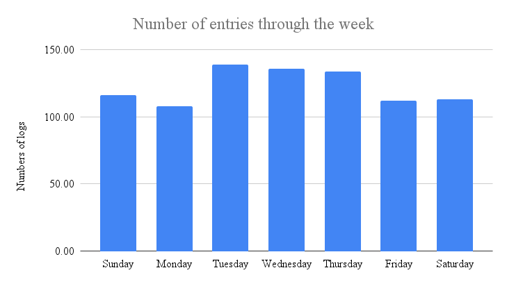
<figcaption aria-hidden="true">Fig.2 Number of entries on daily activity
minutes submitted through the week.</figcaption>
</figure>

20 out of 33 users have submitted their entries through 30 days which is
60.6% of all user’s adherence.

<figure>

<figcaption aria-hidden="true">Fig.3 Users number logginf for particular
amount of days.</figcaption>
</figure>

By analyzing the median percentage time spent through each day of the
week, we can see that the most “active” day is Saturday. Interestingly
Sunday on the other hand is the least active day out of all.  
The type of activity intensity in which users tend to spend the most
time besides sedentary activity ( min. 79.97% on Saturday and max.
82.87% on Sunday) is light activity, which is undertaken the most during
Saturday(16.84%) and Friday(15.96%). The least amount of light activity
was registered yet again on Sunday(14.40%), and Monday(14.85%).  
Fairly active median time is the most stable throughout the week ranging
from 1.04% on Thursday to 1.35% on Saturday.  
The median percentage of time being spent very active is the highest on
Tuesday reaching 2.01% while the lowest value was reported on Sunday.  
Interestingly while comparing the fairly active minutes percentage with
the very active time percentage we noticed that users tend to spend more
time being very active (1.58% - 2.01%) than fairly active (1.04% -
1.35%).

<figure>
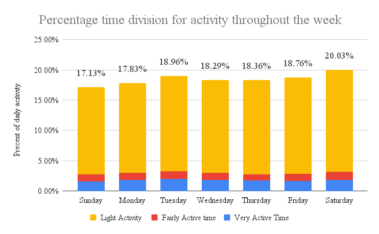
<figcaption aria-hidden="true">Fig.4 Precentage of time in minutes
dedicated by user for activity with given intensity.</figcaption>
</figure>

## Summary of the daily activity time

- Most entries are being submitted in the middle of the work week,
  Tuesday-Thursday, while on Monday we can observe a more than 20%
  decrease in the number of entries.  
- 60.6% adherence rate of users logging their activity for 30 days.  
- The most active day is Saturday, and Tuesday during the work days.  
- The least active day of the week is Sunday and Monday during the work
  days.  
- Most of the percentage time users spend sedentary (79.97%-82.87%),
  light activity (14.40%-16.84%), thirdly the very active time (1.58% -
  2.01%) and lastly fairly active (1.04% - 1.35%).

**1. Suggestion regarding users:** Regarding that Sunday and Monday are
the least active, while simultaneously having the least entries, I would
advise starting walking or sports events on these days, to improve entry
numbers as well as activity levels through these days. Bellabeat
membership guidance should promote walking with family, or bike rides on
Sunday as a weekend day that should be spent with family. On Monday
should propagate walking or riding by bike to work, choosing stairs, or
standing up every 45 min from the user desk to briefly stretch or have a
few steps. Additionally, we should encourage users to log in more
frequently by adding perks and awards through continuous log entries to
keep users motivated.

**2. Marketing suggestion:** Since Monday and Sunday are the least
active days the advertisement should focus on promoting a fun way of
staying active and how Bellabeat membership can help with that,while
allowing for enjoying great health.

## Daily activity distance

**Disclaimer** Records where Sedentary Distance was different than zero
were treated as measurement mistake and were excluded from the further
analysis.  
Regarding bumper of entries is analogical to the activity minutes
through the week with Monday being the day with the least entries (108),
and Tuesday with the highest count (139). Equaling to 22% difference
between the highest and smallest value.

<figure>

<figcaption aria-hidden="true">Fig.5 Number of entries on daily activity
distance submitted through the week.</figcaption>
</figure>

Users go through the longest distance on Tuesday on average 5.94,
another day with the highest distance is Wednesday with 5.60. On the
contrary on Sunday, users travel the least distance on average 4.81, and
the second lowest distance value belongs to Friday with 5.26.  
Additionally, it is worth noticing that there is a consistent inaccuracy
between total distance, tracker distance, and summed distance for all
activity intensity types, which in theory should be equal.

<figure>

<figcaption aria-hidden="true">Fig.6 Difference bewteen distance
registered by different values.</figcaption>
</figure>

The plot below visualizes the tracker difference value throughout the
week, which shows that Tuesday, Wednesday, and Thursday have the highest
difference between registered total distance and tracker distance. This
mistake might have occurred due to different Fitbit devices, but shows
an unsettling pattern where with an increased amount of entries the
mistake is only getting bigger.

<figure>
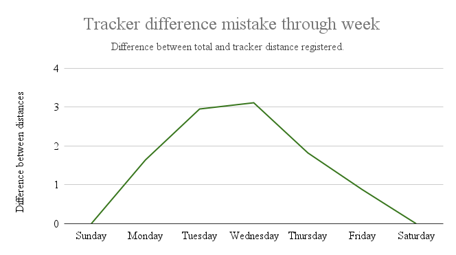
<figcaption aria-hidden="true">Fig.7 Mistake between tracker difference
and total distance measured by the devices of the users.</figcaption>
</figure>

## Daily steps

The most steps (on average) are taken on Tuesday(8125) and
Saturday(8152). While the least steps number can be observe on
Thursday(7405) and Sunday (6933).

<figure>

<figcaption aria-hidden="true">Fig.8 Average steps count for each day of
the week.</figcaption>
</figure>

The plot below shows 97% correlation between steps taken and distance
traveled by the users, which is a high value. This means that these
traits are correlated and depend on each other as they should.

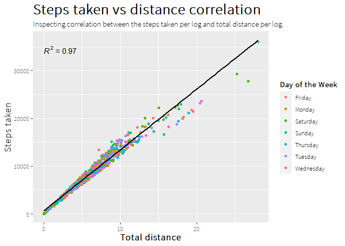<!-- -->

## Summary of daily activity distance and steps

- Most entries are submitted on Tuesday, Wednesday and Thursday. The
  last entries were submitted on Monday leading to a 22% decrease on
  that day.  
- Users tend to travel the longest distance on Tuesday and Saturday.
  Shortest distance users tend to travel on Sunday and Friday, which is
  reflected in the number of steps.
- There is 97% correlation between distance traveled and steps taken.  
- There is an inconsistency between the total distance tracked, tracker
  distance, and cumulative sum of distances of different intensities.  
- The difference in value recorded by total distance and tracker
  distance grows with the increase of several entries.  
- The most steps are taken on Saturday and Tuesday. Least steps are
  taken on Sunday.

**1. User suggestion:** Encouraging users for weekend family activity
outdoors or indoors (based on the weather forecast), to increase their
step count. On Monday and Friday, the Bellabeat membership guidance app
should focus on promoting “steps” busting tactics at work or during the
commute. For example: standing up every 45 min and going for water,
walking to work, or parking your car further from the entrance.
Additionally, consistent recording by the user should be awarded in the
form of a discount on another month or by gadgets or content that will
be unlocked by certain entries through a certain period.

**2. Marketing suggestion:** The Highest number of entries during the
middle of the week shows that people are most dedicated to recording and
measuring their activity these days. During these days advertisements
should focus on tracking the ability of our devices, while on days with
fewer entries and activity Bellabeat advertisements should focus more on
propagating movement in fun and creative ways. For example when the
advertisement is on the radio encourages listeners to listen to the
music even when they are waiting for the bus, when the advertisement is
on social media encourages people to go for a 5-minute walk around the
block, or even a living room. It would be suggested to back up the
movement’s cognitive benefits with a research paper.  
[Like
this](https://www.frontiersin.org/articles/10.3389/fpubh.2018.00100/full)

**Technical issues:** The inconsistency in tracker distance, total
distance, and summed distance of all activity intensity should be
examined by the software team since it might lead to skewed measurement
and inaccuracy, which might drive away potential customers.

## Daily calories

The number of calorie intake through the week has a similar pattern to
those seen in daily activity entries, meaning more entries during the
middle of the week From Tuesday to Thursday, and a decrease during other
days. While the highest number of entries is 152 on Tuesday the lowest
number appears on Monday and equals 120, which can be calculated as a
21% decrease in entry number.

<figure>

<figcaption aria-hidden="true">Fig.9 Number of calories entries through
the week.</figcaption>
</figure>

The highest caloric intake of our users can be observed on Tuesday(2229
kcal/day) and Friday (2203 kcal/day), while the least caloric intake can
be observed on Thursday (2065 kcal/day) and Sunday (2063 kcal/day).

Additionally, I have analyzed the standard deviation for each day, which
shows that the biggest variety of consumed calories can be observed on
Saturday and Thursday. The more red the bar is the bigger the standard
deviation.

<figure>
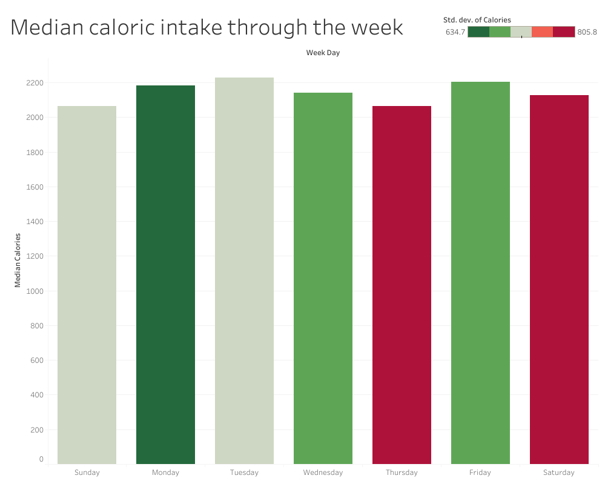
<figcaption aria-hidden="true">Fig.10 Median caloric intake of the users
with standard deviation through the week.</figcaption>
</figure>

Inspecting correlation between caloric intake and distance traveled by
the users. There is a weak correlation about 41%.

    ## `geom_smooth()` using formula = 'y ~ x'

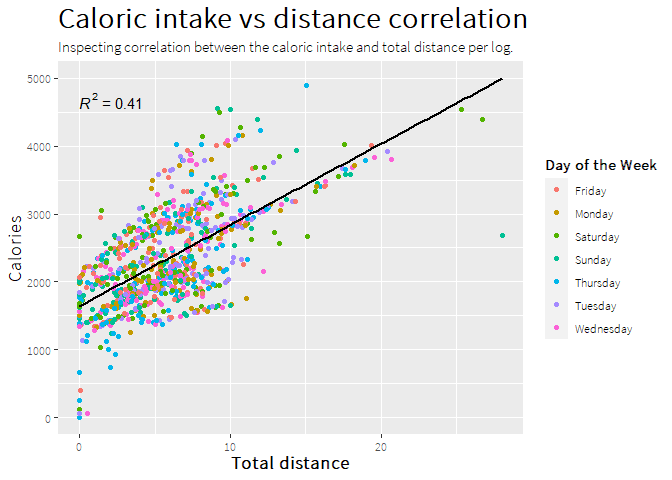<!-- -->

There is also very weak correlation between steps taken and caloric
intake, around 35%.

    ## `geom_smooth()` using formula = 'y ~ x'

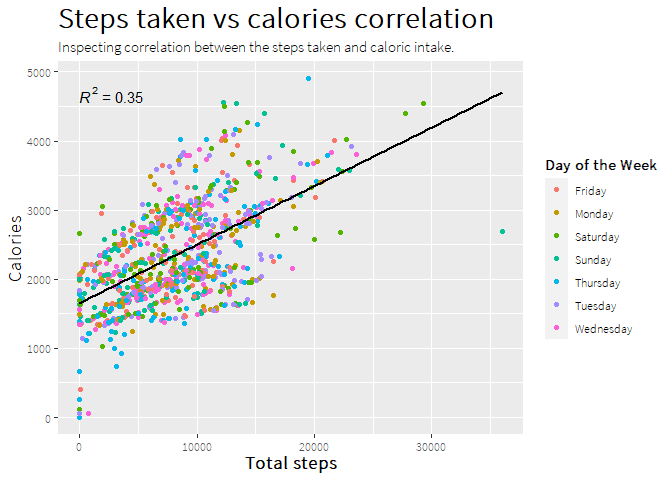<!-- -->

## Summary of daily calories

- Caloric intake is more or less stable through the week, with the
  highest value being 2229 kcal/day on Tuesday, while the lowest is 2063
  kcal/day on Sunday.
- The biggest standard deviation value was registered for Saturday and
  Thursday, while the lowest was on Monday.
- The lowest number of entries was also submitted yet again on Monday,
  with a 21% decrease in number in comparison to the day with the most
  entries which is Tuesday.
- There is no significant correlation between steps or distance and
  caloric intake.

**1. User suggestion:** Yet again the idea of encouraging users to
continuously record their measurements should be implemented in a way
that will be attractive to the user.

# METs

Let’s start with explaining what METs are, METs are short for metabolic
equivalent of task, which is a measurement of energy use for a
particular task- so basically intensity of a given task. For example,
sitting is 1 MET. However, since our plot consists of average MET value
per single log per person our scale starts at around 10 and tops at 22.

The lowest average METs are registered between 22:00 and 5:00 which is
caused by most users sleeping being a low-intensity activity. MET value
starts to rise around 5:00 and rises steadily until 7:00 during workdays
while in the case of the weekend days the rise continues until around
10:00 (Sunday) and 13:00(Saturday). This points to less busy mornings on
weekends.

Between hours 7:00-15:00 during workdays MET values are more or less the
same, however, they stay at a pretty high value around 17 which would
point to users having pretty active work (maybe walking or standing).  
Around 16 we can spot a slight yet sudden increase in METs value, which
peaks around 17:30 with value 20. Considering rush hours this hour
corresponds with the end of work and heading home by users. Especially
since this value only decreases steadily until the end of the day.

Regarding work days Tuesday and Thursday seem to have more subtle
differences in MET values in comparison to the rest. While Monday,
Wednesday, and Friday are more variable.

Sunday is the day when the METs value is the most stable after peaking
at value 18 at 10:00. This value proceeds until 17:00 while a decrease
in METs value can be observed. Saturday seems to be a more active
weekend day since the highest value is 21 at noon.

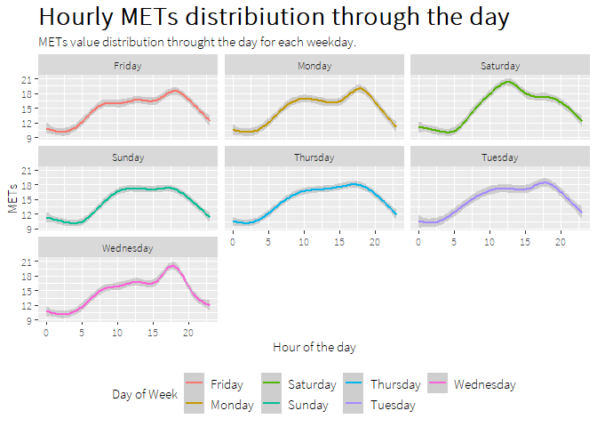<!-- -->

# Heart Rate

**Disclaimer** The heart rate data can’t be used for the assessment of
stress since we do not possess the proper data. Stress is being measured
by so-called heart rate variability (HRV) or in newer devices by
electrodermal activity (EDA).
[Source](https://integrisok.com/resources/on-your-health/2021/may/how-tech-can-help-track-stress-levels)
In case of EDA we do not have a data on changes in the electrical
activity of the skin of the user. Regarding HRV which is measured by the
variation between single heartbeats, which is measured in milliseconds.
[HRV measurement](https://www.ncbi.nlm.nih.gov/pmc/articles/PMC5624990/)
Upon the inspection of the heart rate data, we can see that the smallest
time unit being recorded is second, which means that these data cannot
be used for the stress assessment and analysis of that factor. [More on
HRV
measurement](https://www.health.harvard.edu/blog/heart-rate-variability-new-way-track-well-2017112212789)

Chart visualize the distribution of registered heart rate in beats per
minute(BPM) for each hour of the day, for each day of the week.

Based on the plot we can see that the heart rate of users falls to its
lowest point around 2:30 every day reaching 70 BPM. Then in the case of
Monday, Wednesday and Friday heart rate rises until around 7:00 to 90
BPM, and from that point on it will slowly rise until 18:00. The most
stepped rise can be observed during Monday when the heart rate peaks
around 99 BPM.

Plots regarding Sunday and Saturday show analogical values regarding the
lowest heart range value, and rise until 7:00. However from that point,
it seems to fluctuate between peaks and valleys. Leading to three heart
rate peaks throughout the day first one being the one already mentioned
at 7:00 with 90 BPM, the second at 12:30 with 95 BPM, and the last one
around 18:00 with the value of around 90 BPM.

Interestingly heart rate value curve is pretty smooth in the case of
Thursday. Slow steady rise from 70 BPM to 95 BPM around 15:00. In
comparison the 90 BPM value which is reached regularly by 7:00, on
Tuesday isn’t reached until 10:00, while on Thursday it is 9:30, which
can be considered late at the comparison to rest of the week.

Every day heart rate decreases around 22:00 which is the average time
when most people start to wind down after a whole day and start
preparing to sleep. According to the SleepCycle report “average”
American goes to sleep at 23:39 and wakes up at 7:09 which leads to a
peak in heart rate.
[Source](https://www.sleepcycle.com/sleep-science/what-we-know-about-americas-healthiest-happiest-best-rested/)

    ## `geom_smooth()` using formula = 'y ~ s(x, bs = "cs")'

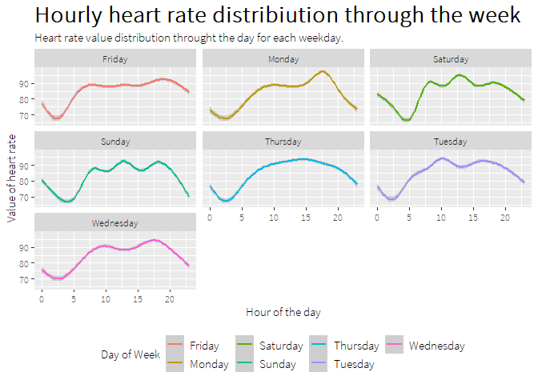<!-- -->

# HR vs METs

Plot visualize the average heart rate value for a single log against a
single record METs value each logged by the average person. The R square
value does not exceed even 0.1 which points to a very weak (almost
non-existent) correlation between these two variables. Even though on
previous plots it seems like some correlation might appear especially
for days such as Monday or Thursday. Indeed these days show a bit
stronger correlation than the rest of the days, nonetheless, the value
is still not high enough to decide that the correlation between HR and
METs exists.

Here one of the deciding factors might be the case that METs hold
records of 33 users, while in the heart rate table, only 14 of them can
be found leading to shrinkage of the measured sample to 14 records which
does not reach the minimum value for the reliable correlation analysis.
[Source](https://forms.app/en/blog/correlation-between-research-type-and-sample-size?fbclid=IwAR2pmxF357ygNUjtFbynTZn1ovWjOwPydqdYhK2T97SDVWe1PnhTjSpGdVI)

The best way to obtain meaningful analysis would be to obtain at least
16 users to record their heart rate values over 30 days.

    ## `geom_smooth()` using formula = 'y ~ x'

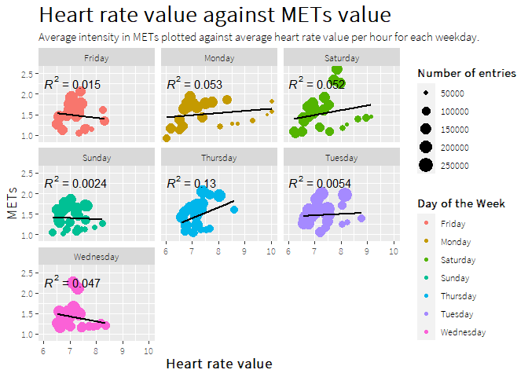<!-- -->

## Hourly value of intensity, calories burned per hour and steps taken

Close inspection of each pattern for the hour distribution of steps,
intensity, and calories revealed that their curves are similar, leading
to the conclusion that they might correlate with each other.  
Furthermore, the plots from heart rate values seem to correspond with
those with intensity.  
The steps peak during weekdays can be observed first at 7:00 to 8:00 and
then at around 18:00 which overlap with regular rush hours leading to an
increase in steps taken by the users.

### Intensity hourly distribution through the week

Plot visualize the average intensity for every hour through the day, for
each of the weekdays.

    ## `geom_smooth()` using formula = 'y ~ s(x, bs = "cs")'

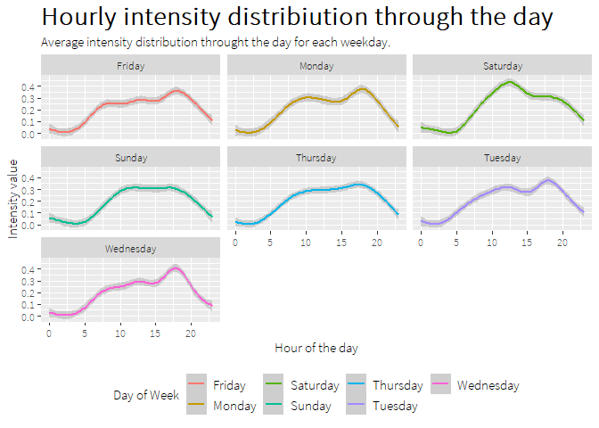<!-- -->

### Steps taken hourly distribution through the week

Plots visualize total steps count for each hour of the particular day
from the week.

    ## `geom_smooth()` using formula = 'y ~ s(x, bs = "cs")'

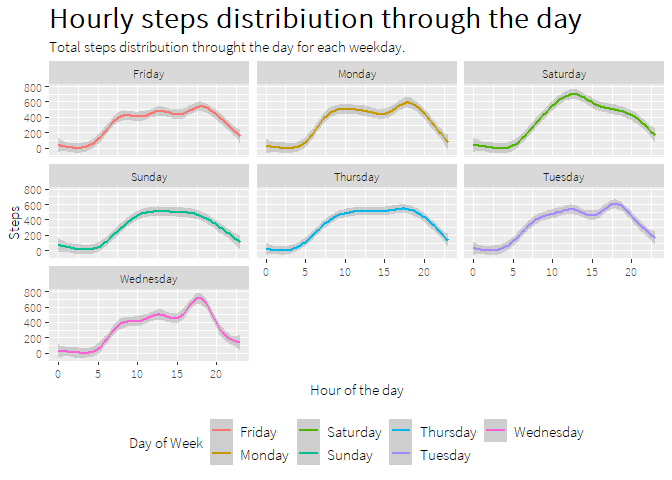<!-- -->

### Calories through the day for each day of the week

Plot visualize average calorie burn per each hour of the day, for each
day of the weekday.

    ## `geom_smooth()` using formula = 'y ~ s(x, bs = "cs")'

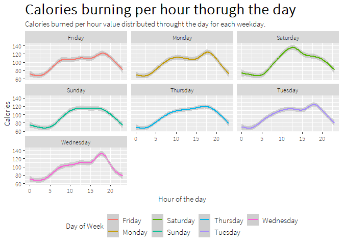<!-- -->

## Correlation between hourly values

Since all three hourly distribution plots seem to correlate with one
another I decided to check it by merging these tables, and further using
that data to create scatter plots to visualize the hypothetical
dependency.  
First I have merged the data (in BigQuery, SQL queries can be found in
my repository on GitHub) and found the average measure (total intensity,
calories burned, or steps taken) for a single entry by a single person,
for each hour of the day during the whole week.  
Additionally, I have installed the package ggpubr which contains the
‘stat_regline_equation’ function which calculated the formula and R2
(coefficient of determination) which will help me to identify the linear
relationship between two variables. The R2 = 1 means a 100% correlation
between variables A and B.

### Intensity vs Calories

By investigating our plots we can see that the lowest R square value is
0.99 which means that we observe a 99% correlation between Intensity and
Calories, which is a pretty high value. It is also worth mentioning that
Thursday, Tuesday, and Wednesday are days where number of entries is
higher in comparison to the other days. On the other hand, Monday and
Sunday seem to have the least amount of entries, which might influence
on slightly higher R2 value in the case of Sunday.  
Nonetheless, R2 is still high, which points to both of these variables
being strongly correlated.

    ## `geom_smooth()` using formula = 'y ~ x'

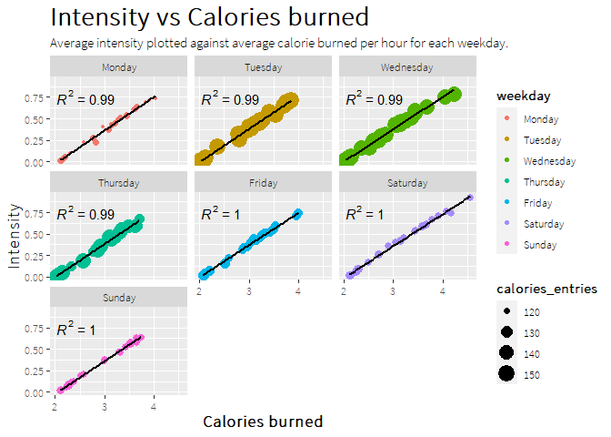<!-- -->

### Steps vs Intensity

Here we can observe more variability among the traits, especially for
days such as Monday and Friday where R values are 0.96 and 0.95 which
puts them on the border of our analysis. On the other hand, weekend days
are still showing a pretty strong correlation.  
Several entries however follow the same pattern as it was in the
previous plot.

Altogether correlation between steps taken and intensity through the day
is still strong, however is not as much as the correlation between
intensity and calories.

    ## `geom_smooth()` using formula = 'y ~ x'

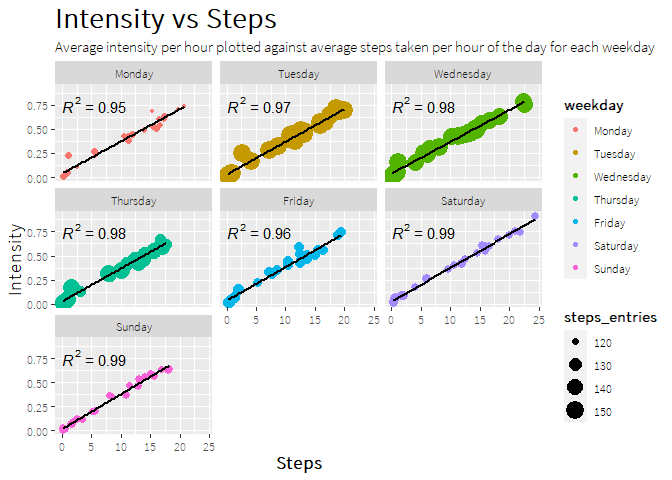<!-- -->

### Calories vs Steps

R square during Monday equaling reaches the lowest value of all hourly
plots with 0.93, next is Tuesday(0.95), Friday(0.96), Thursday(0.97),
Sunday and Wednesday at 0.98 and finally Saturday with 0.99. This points
to the lowest correlation value of all three plots. Correlation above
0.95 (depending on the discipline) is considered pretty high thus we
will conclude here that all of these three variables are correlated with
each other.  
Although intensity is more strongly correlated with calories and steps,
then steps and calories are to each other.

Regarding the number of entries Monday, Friday, Sunday and Saturday are
the least logged day.

    ## `geom_smooth()` using formula = 'y ~ x'

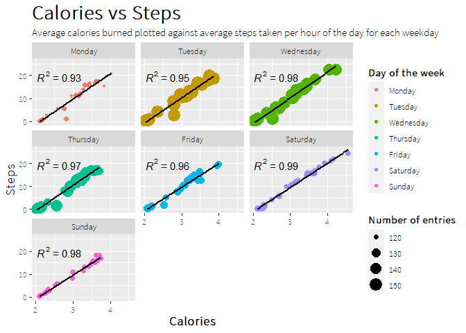<!-- -->

## Summary of the METs and heart rate data

### Heart rate

- Most variable heart rates can be seen during weekend days.  
- Highest values of heart rate are Monday 17:00, Tuesday 10:00,
  Wednesday 17:00, Thursday 15:00.

**1. Marketing suggestion:** Advertising stress guidance (Bellabeat
membership), with fast free 2 min breathing exercises in mentioned
hours: Monday 17:00, Tuesday 10:00, Wednesday 17:00, Thursday 15:00.

### METs

- Based on METs values Saturday is the most active day of the weekend
  while Wednesday is the most busy workday.  
- The least active weekend day is Sunday, and the work day is Thursday.

**1. Suggestion for users:** Activity reminder around noon on Sunday
regarding going on a walk or having a bike trip. This could be dependent
on the weather forecast, on which it will propose either
outdoor(walking, bike) or indoor activities (yoga). Activity reminder:
fast stretching at work, or a five-minute break to get “Fresh air”
around 15:00, since this value has the highest heart rate during the
day, “5 minutes relax” might help the users to unwind for a bit.

- Correlation can’t be assessed due to insufficient sample size (min 30)
  of an analyzed group of users. To perform correlation analysis, 16
  more users are needed at least.

## Summary of the hourly data

- All three values correlate with each other, thus their plots are
  almost the same.

- The most intensive part of the work day is between 7:00 and 17:30,
  which are work hours, pointing to our users having pretty active work.

- During the weekend days users tend to start activity later on in the
  day around 10:00. During the weekend people tend to sleep longer.
  [Source](https://www.franciscanhealth.org/community/blog/sleeping-in-weekends-sleep-debt)

- The days with the least amount of entries are Monday, Sunday, and
  Saturday. The highest entry number can be observed on Tuesday,
  Wednesday, and Thursday.

**1. Suggestion users:** Implementing reminders for logging in by
gamifying the logging process (especially steps and intensity) boards
through Monday, Sunday, and Saturday to increase the number of entries
during these days. Proposed hours: 7:00 (Monday) or 10:00(Sunday and
Saturday), 12:00, 17:00, and finally around 20:00. Start implementation
by max 2 reminders per day so that the user won’t get estrange.

**2. Suggestion advertisement:** Since most users tend to go to work
around 7:00 and come back around 17:30. This time would be great to
upscale advertisement on social media, radio, and public transport.

- Correlation analysis: This shows that all three values are strongly
  correlated with one another. Although it would be advised to obtain
  the records from 100 users, logging for 30 days to strengthen the
  data.

# Sleep data analysis

## Minutes asleep through the week

By analyzing the violin plot we can see that users tend to sleep the
longest on Sunday(7.5 h on average), on the other hand, people sleep the
least on Thursday (6.68 h on average). Saturday is the day with the most
variability in its measurements.  
Interestingly Wednesday (7.24 h) and then Monday(6.99 h) are the work
days when more than a half (Wednesday) or at least half (Monday) of
users tend to sleep the longest excluding Sunday.  
The number of entries of users’ length of sleep which was the closest to
the average was logged on Wednesday, Thursday, and Friday. It might be
caused by a different amount of entries submitted on each day, thus I
have decided to analyze it in the next plot.

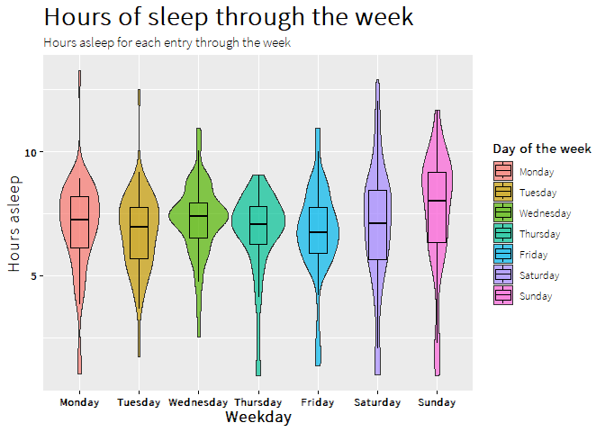<!-- -->

## Number of entries through the week

Based on we can see that the last entries were submitted on Monday with
47 entries. If we also consider Wednesday being the day with the most
entries submitted with the value of 66 logs, we can calculate that on
Monday we have almost 29% fewer entries.  
Let’s look at Sunday now where we can observe the least entries during
the weekend days, with 55 entries which is a bit less difference than in
the case of Monday, but still more than a 16% decrease.

This difference might contribute to a shift in the sample coverage of
certain quartail in the previous plot as well as in the next one where I
will analyze the amount of time spent in the bed awake for each
weekday.  
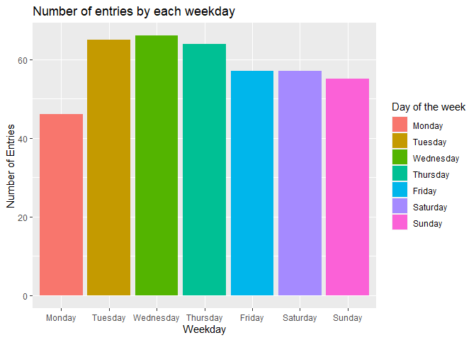<!-- -->

## Minutes asleep vs minutes spend in bed

On Sunday people tend to spend the most time being awake in bed with the
majority spending more than 50 min. Thursday and Wednesday are the days
when users tend to spend the least time being awake in bed with an
average of around 33-35 min.

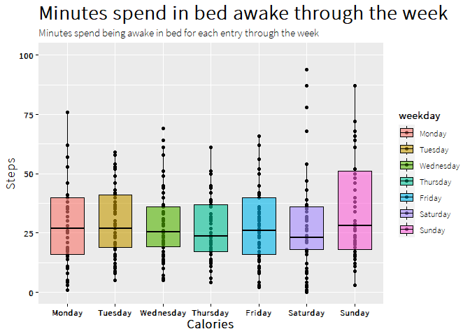<!-- -->

## Assesing the amount of sleep

228 user entries meet the minimum 7 hours of sleep according to [Mayo
Clinic](https://www.mayoclinic.org/healthy-lifestyle/adult-health/expert-answers/how-many-hours-of-sleep-are-enough/faq-20057898),
which is 60% of all entries.  
181 user entries do not meet that requirement.  
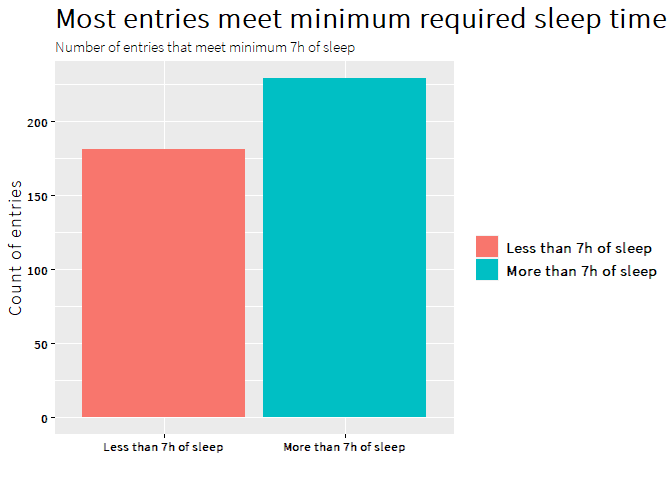<!-- -->

There is an interesting tendency visible in the data the number of
entries meeting the minimal requirement for sleeping hours rises from
Monday until Wednesday where it peaks with 45 entries. Since then number
of these entries has fallen until Friday. During Saturday and Sunday
number of entries with sleeping time of more than 7 hours rises again.

Tuesday and Friday are the days where the number of entries with
sleeping hours below 7 rises the number of entries meeting the
requirements of sleep time. Tuesday simultaneously being the top day
with 35 entries where users slept less than 7 hours, while Friday
reached 27 entries.

A top number of entries is noted on Wednesday with 45 entries, the next
one is the Sunday with 37 entries.

## Summary sleep

- Users tend to sleep the most on Sunday on the weekend and Wednesday on
  workdays. On the other hand, they get the least sleep on Thursday.

- Again sleep data shows us that Monday, Friday, Saturday, and Sunday
  are the days where a decrease in several entries submitted by the user
  is observed. With Monday counting the last entries.

- Users tend to spend the most time being awake in the bed on Sunday on
  the weekdays, and on Friday and Tuesday during work days.

- 60% of entries of the users tend to meet the minimum requirement of 7
  hours of sleep minimum. The highest number of these entries is noted
  on Wednesday and Sunday.

- Tuesday poses an alarming statistic where 54% of entries do not meet
  the 7-hour mark of sleep time. Together with Friday, these are two
  days where several entries below 7 hours of sleep exceed the entries
  with a required minimum amount of sleep.

**1. Suggestion users:** Regarding the fact that the most time being
awake in bed is being spent on Tuesday and Friday, while also the same
days tend to have the most entries where the sleep time is below the 7
hours I propose to implementing prompts during this days around
21:00(since also the intensity decreases at that time and so does the
step) promoting “clean sleep” techniques such as reducing exposition to
blue light, airing the bedroom etc. To help them reduce the time of
being awake in bed, simultaneously prolonging their sleep time.

**2. Suggestion advertisement:** Considering that Tuesday and Friday are
the days when most of our users tend to get the least sleep, we can
think that it might be reflected at least partially in the population.
Thus the days after the least sleep people will be more prone to peak
messages regarding a good night’s sleep and well rest, furthermore
morning hours such as 5:00 to 10:00 would be good hours on Tuesday and
Friday for advertising the Bellabeat membership with sleep guidance,
Bellabeat app, Leaf and Time.

# General summary

**1. Number of entries:**

- Entry patterns: Fewest on Monday, Sunday, and Saturday; highest on
  Tuesday, Wednesday, and Thursday.  
- Entry consistency: Fewest entries on Monday, 21% decrease compared to
  Tuesday with the most entries.

**2. Sleeping patterns:**

- Users’ sleep patterns: Most sleep on Sunday and Wednesday, least on
  Thursday.  
- Awake time in bed: Users spend more time awake in bed on Sunday,
  Friday, and Tuesday.  
- 60% of entries meet 7-hour sleep requirement: Highest on Wednesday and
  Sunday, alarming 54% on Tuesday and Friday.

**3. Activity patterns:**

- Active work hours: Most active between 7:00 and 17:30, indicating
  active work.  
- Weekend activity starts later: Activity starts around 10:00 on
  weekends, indicating longer sleep.

**4. Heart rate patterns:**

- Heart rate variability: Highest during weekends, specific high values
  on Monday 17:00, Tuesday 10:00, Wednesday 17:00, Thursday 15:00.

**5. Intensity patterns:**

- METs values: Saturday most active weekend day, Wednesday busiest
  workday; Sunday and Thursday least active.

**6. Caloric intake patterns:**

- Caloric intake stability: Stable throughout the week, highest on
  Tuesday (2229 kcal/day), lowest on Sunday (2063 kcal/day).

**7. Travel and steps pattern:**

- Travel patterns: Longest distance on Tuesday and Saturday, shortest on
  Sunday and Friday; 97% correlation between distance and steps.  
- Step count: Most steps on Saturday and Tuesday, fewest on Sunday.  
- Inconsistencies in distance tracking: Discrepancy between total
  distance, tracker distance, and cumulative distances of different
  intensities.  
- Correlation between sleep, activity, and heart rate values.

# Suggestion for the stakeholders

**Users suggestions:**

1.Promote family activities and active work habits.  
2.Reward consistent user recording with discounts or gadgets.  
3.Implement timely reminders and gamify logging process.  
4.Address sleep issues with prompts and “clean sleep” techniques.

- More specific plan:

  Sunday: Promote family walks or bike rides.  
  Monday: Encourage walking or biking to work, taking stairs, and
  regular stretching breaks.  
  Friday: Emphasize steps-boosting tactics at work, like taking short
  breaks and walking to places.  
  Sunday: Send reminders for outdoor or indoor activities around noon
  and short breaks at 15:00. Monday, Sunday, Saturday: Implement login
  reminders at 7:00, 10:00, 12:00, 17:00, and around 20:00.  
  Tuesday, Friday: Introduce prompts at 21:00 for better sleep,
  promoting “clean sleep” techniques.

**Marketing suggestions:**

1.  Focus midweek ads on device tracking, and creative movement on
    low-activity days.
2.  Support ads with research on cognitive benefits of movement.
3.  Advertise stress guidance during specific hours.
4.  Target ads during commuting times and after poor sleep periods

- More specific plan:

  Midweek: Focus ads on device tracking.  
  Low-activity days: Advertise creative movements, backed by research,
  on social media and radio.  
  Specific Hours: Offer stress guidance at 17:00 (Monday), 10:00
  (Tuesday), 17:00 (Wednesday), and 15:00 (Thursday).  
  Morning Hours (Tuesday, Friday): Advertise sleep guidance, Bellabeat
  app, Leaf, and Time from 5:00 to 10:00.

**Technical Issues:**  
Address inconsistencies in tracker data promptly to maintain accuracy
and customer trust.
